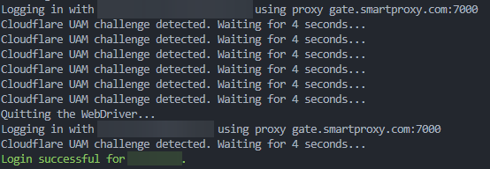

# XenforoChecker
Quick and dirty [Xenforo](https://xenforo.com/) Forum account's checker using [Undected chromedriver](https://github.com/ultrafunkamsterdam/undetected-chromedriver) & proxies.

**Only used for testing some stuff, has:**
- 📶 Proxy support
- ☁ Cloudflare detection and handling

If your site is heavily protected, I recommended using good res proxies.

**Bugs:**
- can crash, etc..
- might be different for your Xenforo login page, change the HTML values in the code.
- doesn't have threading so pretty slow, feel free to add yourself
